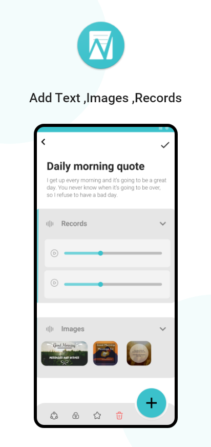
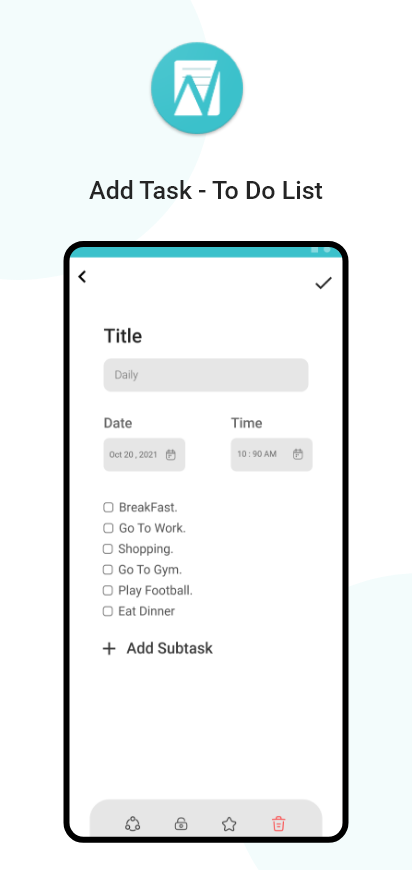
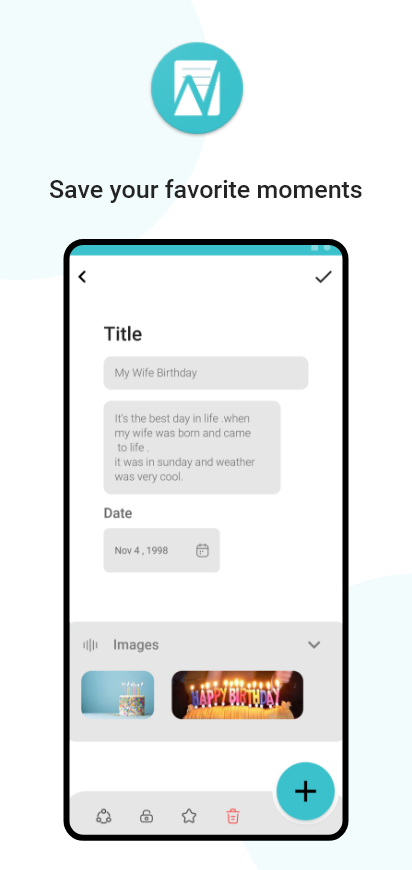
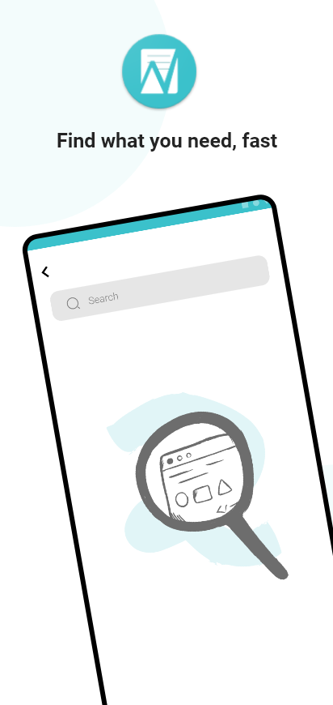
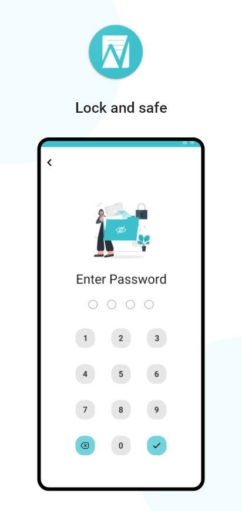
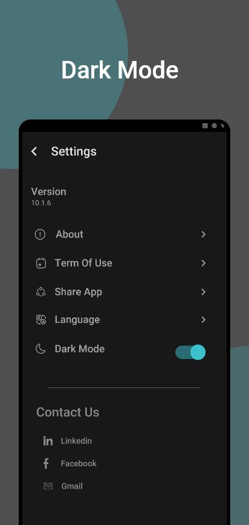

# <b > Nota</b>

 

#   Nota : Notes - Tasks - Memories 

 - NotePad to capture ideas , Task List and save your memories to always remember.
 - Nota is a small and fast app to create ,edit notes ,tasks list and save a memory.
 - Write whatever you want, put a picture or an audio recording to hear it whenever you want, add your missions as a tasks to motivate you to complete them and organize your tasks and put all your memories details and photo to always remember them whenever you want.

 
 
## <b> Important Links </b>  

- ### <b> Application Apk On Google Play </b> 
    https://play.google.com/store/apps/details?id=com.nota.notes_app
    

- ### <b> Project WebSite Link </b>  
    https://magdyebrahim24.github.io/Nota/
    
 

## Application Features

-  simple interface and easy to use.
-  create text , photos and records note.
-  create task and to do list to organize your task.
-  save your favorite moments in a memory section.
-  no limits on length or number of notes ,tasks and memories.
-  save your preferable note, task and memory in favorite for easy access.
-  find what you need, fast
-  sharing notes ,tasks ,memories with other apps.
-  secret section with password lock.
-  save your private note ,task and memory in secret to be the only one how can with own password you created.
-  two theme dark and light.
-  support english and arabic languages.
-  no Ads

 
 

## Project Framework Repositories 
 - <b>UI / UX</b>   https://github.com/mohamedebrahim4399/api_documention
 - <b>Mobile Application </b>   https://github.com/magdyebrahim24/the_disease_fighter
- <b>Machine Learning</b>   https://github.com/alaahendam/AI-project
- <b>WebSite</b>   https://github.com/Mariam-wael22/code.git

 
 

 